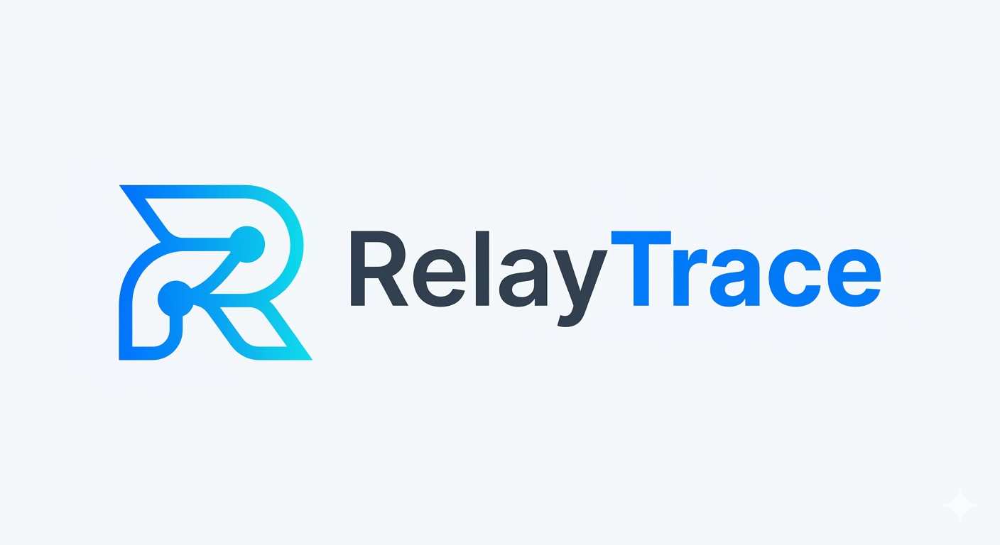
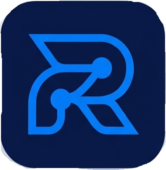

<div align="center">


<br /><br />

# Arquitectura General del Sistema

<p>
  
  
  
  
</p>

<p>
  
  
  
  
  
</p>

<br />

> Documento vivo de arquitectura técnica, decisiones de diseño y roadmap del sistema.  
> Actualizado a **Mayo 2026** — Fases 1, 2A y 2B completadas.

</div>

---

## 📋 Índice

| # | Sección |
|---|---------|
| 1 | [El Problema y la Solución](#1--el-problema-y-la-solución) |
| 2 | [Visión de Producto](#2--visión-de-producto) |
| 3 | [Arquitectura del Sistema](#3--arquitectura-del-sistema) |
| 4 | [Stack Tecnológico](#4--stack-tecnológico) |
| 5 | [Repositorios del Monorepo](#5--repositorios-del-monorepo) |
| 6 | [Arquitectura Multi-Tenant](#6--arquitectura-multi-tenant) |
| 7 | [Módulos del Backend](#7--módulos-del-backend) |
| 8 | [Arquitectura del Frontend](#8--arquitectura-del-frontend) |
| 9 | [Flujos de Negocio Clave](#9--flujos-de-negocio-clave) |
| 10 | [Modelo de Datos](#10--modelo-de-datos) |
| 11 | [Seguridad en Capas](#11--seguridad-en-capas) |
| 12 | [Planes SaaS y Límites](#12--planes-saas-y-límites) |
| 13 | [Infraestructura Azure](#13--infraestructura-azure) |
| 14 | [Sistema de Colas — BullMQ](#14--sistema-de-colas--bullmq) |
| 15 | [Roadmap por Fases](#15--roadmap-por-fases) |

---

## 1 · El Problema y la Solución

<table>
<tr>
<td width="50%" valign="top">

### ❌ El Problema

Muchas empresas de transporte que operan con **Amazon Relay** utilizan una **sola cuenta compartida** entre múltiples conductores, lo que genera:

- Cero trazabilidad: nadie sabe qué conductor tomó qué viaje
- Historial inexistente o en Excel/WhatsApp
- Fraude interno indetectable (viajes inventados, no realizados)
- Evidencia solo por screenshots informales
- Sin auditoría ni reconciliación automática
- Litigios sin pruebas al despedir conductores

</td>
<td width="50%" valign="top">

### ✅ La Solución

**RelayTrace OS** actúa como **capa operacional por encima de Amazon Relay**, sin reemplazarlo:

- Cada conductor tiene su cuenta individual en la plataforma
- Registra el Trip ID de su viaje en segundos, desde el celular
- Adjunta foto del comprobante directamente desde la cámara
- El sistema reconcilia automáticamente contra los emails de Amazon Relay
- El administrador tiene trazabilidad total, alertas y auditoría

</td>
</tr>
</table>

```
ANTES                               DESPUÉS
─────────────────────────────       ──────────────────────────────────────
Relay (cuenta compartida)           Relay (cuenta compartida)
        ↓                                   ↓
Conductor A, B, C...                Conductor registra → RelayTrace OS
(¿quién tomó qué?)                          ↓
        ↓                           Trip ID + foto + timestamp + conductor
Screenshots por WhatsApp                    ↓
        ↓                           Reconciliación automática vs emails Relay
Nadie sabe nada                             ↓
                                    Trazabilidad completa · Auditoría · Anti-fraude
```

---

## 2 · Visión de Producto

<div align="center">

</div>

<br />

RelayTrace OS es una **plataforma SaaS B2B multi-tenant** vendida por suscripción mensual a carriers de Amazon Relay. El valor central es simple:

> **"Saber exactamente qué conductor tomó qué viaje, cuándo, con qué evidencia — y detectar fraude automáticamente."**

### Usuarios del Sistema

| Rol | Interfaz | Objetivo |
|-----|----------|----------|
| 🛡️ **SUPER_ADMIN** | Admin Portal | Gestionar el SaaS completo: empresas, planes, onboarding |
| 🏢 **COMPANY_ADMIN** | Admin Portal | Administrar su empresa: usuarios, viajes, reportes |
| 👁️ **DISPATCHER** | Admin Portal | Monitoreo operacional en tiempo real |
| 🚛 **DRIVER** | Driver PWA | Registrar viajes desde el celular en < 5 segundos |

---

## 3 · Arquitectura del Sistema

### 3.1 — Vista de Alto Nivel

```
┌─────────────────────────────────────────────────────────────────────────┐
│                              INTERNET                                    │
└───────────────────────────────┬─────────────────────────────────────────┘
                                │
                    ┌───────────▼───────────┐
                    │   Azure Front Door     │  CDN + WAF + TLS
                    └─────────┬─────────────┘
                              │
              ┌───────────────┴───────────────┐
              │                               │
   ┌──────────▼──────────┐        ┌──────────▼──────────┐
   │   relaytrace-web    │        │   relaytrace-api    │
   │   Next.js 15 PWA    │◄──────►│   NestJS REST API   │
   │   :3001             │  JSON  │   :3000/api/v1      │
   └─────────────────────┘        └──────────┬──────────┘
                                             │
             ┌───────────────────────────────┼───────────────────────┐
             │                               │                       │
   ┌─────────▼────────┐          ┌──────────▼──────┐    ┌──────────▼──────┐
   │  Azure MySQL 8   │          │  Redis 7        │    │  Azure Blob     │
   │  Flexible Server │          │  + BullMQ       │    │  Storage        │
   │  (Prisma ORM)    │          │  (Job Queues)   │    │  (Screenshots   │
   └──────────────────┘          └─────────────────┘    │   OCR Growth+)  │
                                                         └─────────────────┘
```

### 3.2 — Flujo de Datos Principal

```
┌──────────────────────────────────────────────────────────────────────┐
│  DRIVER (celular)                                                     │
│                                                                       │
│  1. Toma foto del comprobante Relay         📸                        │
│  2. Abre la PWA → Register Trip                                       │
│  3. Escribe Trip ID  →  sube foto                                     │
│  4. Toca "Register Trip"                                              │
└────────────────────────────┬─────────────────────────────────────────┘
                             │ POST /api/v1/uploads/screenshot
                             │ POST /api/v1/trips
                             ▼
┌──────────────────────────────────────────────────────────────────────┐
│  BACKEND (NestJS)                                                     │
│                                                                       │
│  TripsService.create()                                                │
│  ├── Valida companyId del JWT                                         │
│  ├── Persiste Trip en MySQL                                           │
│  ├── (Growth+) Encola job OCR → BullMQ                                │
│  └── Retorna Trip creado                                              │
└────────────────────────────┬─────────────────────────────────────────┘
                             │
             ┌───────────────┴───────────────┐
             │                               │
             ▼                               ▼
┌────────────────────┐           ┌──────────────────────┐
│  MySQL Database    │           │  BullMQ Worker       │
│                    │           │  (OCR Job)           │
│  Trip registrado   │           │  Azure AI → Trip ID  │
│  con screenshotUrl │           │  auto-detectado      │
└────────────────────┘           └──────────────────────┘
             │
             ▼
┌──────────────────────────────────────────────────────────────────────┐
│  ADMIN PORTAL (Next.js)                                               │
│                                                                       │
│  Dashboard → ve el viaje en tiempo real                               │
│  Mapa de rutas · KPIs · Tabla de viajes recientes                     │
│  Alertas de discrepancias                                             │
└──────────────────────────────────────────────────────────────────────┘
```

---

## 4 · Stack Tecnológico

### Backend — `relaytrace-api`

| Capa | Tecnología | Versión | Propósito |
|------|-----------|---------|-----------|
| 🧱 Framework | **NestJS** | 11.x | Módulos, DI, guards, interceptors |
| 📝 Lenguaje | **TypeScript** | 5.x | Type safety end-to-end |
| 🗄️ ORM | **Prisma** | 7.x | Acceso a DB tipado, migraciones |
| 🗃️ Base de datos | **MySQL 8** | 8.x | Multi-tenant con companyId |
| 🔐 Autenticación | **JWT + Passport** | — | Access (1h) + Refresh (7d) |
| 📂 File Upload | **Multer diskStorage** | built-in | Screenshots → `public/screenshots/` |
| 📬 Queue | **BullMQ + Redis** | — | OCR async, emails, webhooks |
| ☁️ OCR Storage | **Azure Blob Storage** | — | Screenshots para OCR (Growth+) |
| 🤖 OCR Engine | **Azure AI Document Intelligence** | — | Extracción automática Trip ID |
| 📧 Email Parsing | **Microsoft Graph API** | — | Parser emails Amazon Relay |
| 💳 Billing | **Stripe** | 22.x | Checkout + Webhooks idempotentes |
| 📚 API Docs | **Swagger / OpenAPI 3** | — | Documentación interactiva |
| 🛡️ Rate Limiting | **@nestjs/throttler** | — | 10 req/seg · 100 req/min |
| 🔒 Security | **Helmet** | — | HTTP Security Headers |

### Frontend — `relaytrace-web`

| Capa | Tecnología | Propósito |
|------|-----------|-----------|
| ⚛️ Framework | **Next.js 15** (App Router) | SSR/SSG + rutas por rol |
| 🎨 UI | **Tailwind CSS v4** | Utility-first styling |
| 🖼️ Iconos | **Lucide React** | Iconografía consistente |
| 🔄 Estado servidor | **TanStack Query** | Cache, fetch, mutations |
| 🗂️ Estado global | **Zustand** | Auth store |
| 📋 Formularios | **React Hook Form + Zod** | Validación tipada |
| 🗺️ Mapas | **React Leaflet** (OpenStreetMap) | Mapa de rutas en dashboard |
| 📱 PWA | `site.webmanifest` + favicons | Instalable en móvil |
| 🌐 HTTP | **Axios** | Interceptors JWT + refresh |

---

## 5 · Repositorios del Monorepo

```
RelayTrace-OS/                          ← Monorepo raíz
│
├── 📦 relaytrace-api/                  ← Backend NestJS (REST API)
│   ├── src/
│   ├── prisma/
│   ├── public/screenshots/             ← Uploads de drivers (local dev)
│   └── Dockerfile
│
├── 🌐 relaytrace-web/                  ← Frontend Next.js 15 (PWA)
│   ├── src/app/                        ← Rutas por rol
│   ├── src/components/                 ← UI reutilizable
│   ├── src/services/                   ← HTTP services
│   ├── public/images/                  ← Logos y assets de marca
│   └── Dockerfile
│
├── 🖼️ relaytrace-images/               ← Fuente de verdad de marca
│   └── logos, mockups, brand assets
│
├── 🏗️ relaytrace-infra/                ← Terraform / Bicep (Azure IaC)
│   └── (pendiente Fase 2B)
│
├── ⚙️ relaytrace-workers/              ← BullMQ workers (separados)
│   └── (pendiente Fase 3)
│
└── 📖 relaytrace-docs/                 ← Este directorio
    └── README-General.md               ← Arquitectura general (este archivo)
```

---

## 6 · Arquitectura Multi-Tenant

### Modelo de Aislamiento

```
RelayTrace OS (SaaS Platform)
│
├── 🛡️ SUPER_ADMIN (sin empresa — acceso global)
│   └── Puede ver/operar sobre TODOS los tenants
│
├── 🏢 Empresa A  (tenant_id = "cuid_a")
│   ├── COMPANY_ADMIN  → gestiona su empresa
│   ├── DISPATCHER     → monitorea operaciones
│   └── DRIVERs        → registran viajes
│       └── Trips → Alerts → AuditLogs
│
├── 🏢 Empresa B  (tenant_id = "cuid_b")
│   └── ... completamente aislada de Empresa A
│
└── 🏢 Empresa N  (tenant_id = "cuid_n")
    └── ...
```

### Regla de Aislamiento — Implementación

```typescript
// TripsService.findAll() — patrón aplicado en TODOS los servicios
async findAll(user: RequestUser) {
  const where: Prisma.TripWhereInput = {};

  // SUPER_ADMIN ve todo — el resto solo ve su empresa
  if (user.role !== 'SUPER_ADMIN') {
    where.companyId = user.companyId;   // ← companyId SIEMPRE del JWT
  }

  return this.prisma.trip.findMany({ where });
}
```

> ⚠️ **Invariante crítica:** El `companyId` **nunca** viene del request body. Siempre del JWT firmado.

### Guard Stack por Request

```
Incoming Request
       │
       ▼
┌─────────────┐   401?  ┌────────────────────────────┐
│ JwtAuthGuard│────────►│ Respuesta: 401 Unauthorized │
└──────┬──────┘         └────────────────────────────┘
       │ ✅ token válido
       ▼
┌─────────────┐   403?  ┌────────────────────────────┐
│  RolesGuard │────────►│ Respuesta: 403 Forbidden    │
└──────┬──────┘         └────────────────────────────┘
       │ ✅ rol autorizado  (SUPER_ADMIN bypass)
       ▼
┌─────────────┐   402?  ┌────────────────────────────┐
│  PlanGuard  │────────►│ Respuesta: 402 Upgrade Plan │
└──────┬──────┘         └────────────────────────────┘
       │ ✅ plan suficiente
       ▼
   Controller
```

---

## 7 · Módulos del Backend

### Mapa de Módulos

```
src/modules/
│
├── 🔐 auth/               JWT login · refresh · strategy · me
├── 👤 users/              CRUD · password change · audit log
├── 🏢 companies/          Tenants SaaS · onboarding requests
├── 🎭 roles/              RBAC seed · listado de roles
├── 🚛 drivers/            Abstracción conductores · stats
│
├── ✈️  trips/             ⭐ CORE — registro y trazabilidad de viajes
│
├── 📸 uploads/            diskStorage (todos los planes)
│                          Azure Blob presigned URLs (Growth+)
├── 📋 audit/              AuditLog — historial de acciones sensibles
├── 📊 dashboard/          KPIs: viajes hoy · conductores · alertas
│
├── 💳 billing/            Stripe Checkout · Webhook · idempotencia
├── 🤖 ocr/                Azure AI Document Intelligence (Growth+)
├── 📧 relay-emails/       Microsoft Graph API · parser emails Relay
├── 🔍 reconciliation/     Motor anti-fraude · match/no-match
│
├── ⚡ queue/              BullMQ producers · processors
├── 🔔 notifications/      Alertas · emails transaccionales
└── 🏥 health/             Health checks MySQL + Redis
```

### Detalle por Módulo

<details>
<summary><strong>🔐 Auth Module</strong></summary>

**Responsabilidad:** Autenticación JWT con doble token (access + refresh).

```
POST /auth/login    → { accessToken, refreshToken, user }
POST /auth/refresh  → { accessToken }
GET  /auth/me       → perfil del usuario autenticado
```

**Decisión de diseño:** El `companyId` y `role` van **dentro del payload JWT**, firmados. Nunca se confía en headers externos.

</details>

<details>
<summary><strong>👤 Users Module</strong></summary>

**Responsabilidad:** Gestión completa del ciclo de vida de usuarios por empresa.

```
POST   /users                → crear usuario (COMPANY_ADMIN)
GET    /users                → listar (filtros: companyId, role)
GET    /users/:id            → detalle
PATCH  /users/:id            → editar (nombre, rol, estado)
PATCH  /users/:id/password   → cambiar contraseña + AuditLog
DELETE /users/:id            → eliminar permanente
```

**Auditoría:** Todo cambio de contraseña registra en `AuditLog`:
```json
{
  "action": "change_password",
  "metadata": {
    "targetEmail": "driver@empresa.com",
    "changedBy": "admin@empresa.com",
    "isSelfChange": false
  }
}
```

</details>

<details>
<summary><strong>✈️ Trips Module — Core</strong></summary>

**Responsabilidad:** Núcleo del negocio. Registro y trazabilidad de viajes.

```
POST   /trips        → registrar viaje (DRIVER) + screenshotUrl opcional
GET    /trips/me     → mis viajes paginados (DRIVER)
GET    /trips        → todos los viajes (DISPATCHER+)
GET    /trips/:id    → detalle completo
PATCH  /trips/:id    → actualizar estado
DELETE /trips/:id    → eliminar (COMPANY_ADMIN)
```

**Estados del viaje:**
```
pending  → recién registrado por el conductor
    ↓
confirmed → validado (sistema o admin)
    ↓
flagged   → sospechoso, requiere revisión manual
```

**Fuentes de origen (`sourceType`):**
- `manual` — conductor escribe el Trip ID
- `ocr` — extraído automáticamente del screenshot (Growth+)
- `relay_email` — detectado desde email de Amazon Relay (Fase 4)

</details>

<details>
<summary><strong>📸 Uploads Module</strong></summary>

**Responsabilidad:** Gestión de archivos en dos modalidades según el plan.

| Endpoint | Plan | Storage | Uso |
|----------|------|---------|-----|
| `POST /uploads/screenshot` | Todos | Multer diskStorage → `public/screenshots/` | Foto del viaje desde celular |
| `POST /uploads/presigned-url` | Growth+ | Azure Blob SAS URL | Upload para OCR |

**Flujo screenshot (todos los planes):**
```
Driver selecciona foto
       ↓
POST /uploads/screenshot  (multipart, ≤ 10 MB)
       ↓
Multer → public/screenshots/<uuid>.jpg
       ↓
ServeStaticModule sirve en /screenshots/<uuid>.jpg
       ↓
Trip.screenshotUrl = "http://api-host/screenshots/<uuid>.jpg"
```

</details>

<details>
<summary><strong>💳 Billing Module</strong></summary>

**Responsabilidad:** Subscripciones SaaS via Stripe con idempotencia garantizada.

```
POST /billing/create-checkout  → genera Stripe Checkout Session
POST /billing/webhook          → procesa eventos Stripe (HMAC verificado)
```

**Flujo completo de onboarding:**
```
Landing Page "Get Started"
       ↓
Solicitud de empresa (CompanyRequest)
       ↓
SUPER_ADMIN aprueba → se genera link de pago
       ↓
Stripe Checkout Session (metadata: companyName, plan, adminEmail)
       ↓
Cliente paga → Stripe dispara checkout.session.completed
       ↓
Webhook verificado (HMAC SHA-256)
       ↓
Idempotencia: ProcessedWebhookEvent.stripeEventId @unique
       ↓
Company + COMPANY_ADMIN creados automáticamente
```

</details>

<details>
<summary><strong>📋 Audit Module</strong></summary>

**Responsabilidad:** Log inmutable de acciones sensibles del sistema.

**Acciones auditadas:**
```
create_user      · delete_user
change_password  · revoke_access · restore_access
approve_request  · reject_request
stripe_payment   · plan_upgrade
```

**Estructura del log:**
```typescript
AuditLog {
  id:        cuid
  companyId: string        // tenant
  userId:    string        // quién realizó la acción
  action:    AuditAction   // qué acción
  metadata:  JsonObject    // contexto completo
  createdAt: DateTime
}
```

</details>

---

## 8 · Arquitectura del Frontend

### Rutas por Rol

```
app/
│
├── page.tsx                          ← Landing pública
│
├── auth/
│   └── login/page.tsx                ← Login universal
│
├── admin/                            ← SUPER_ADMIN + COMPANY_ADMIN
│   ├── layout.tsx                    ← SidebarProvider + AdminShell
│   ├── dashboard/page.tsx            ← Mapa + KPIs + Viajes recientes
│   ├── trips/page.tsx                ← Gestión de viajes
│   ├── drivers/page.tsx              ← People: CRUD de usuarios
│   ├── reconciliation/page.tsx       ← Motor anti-fraude
│   ├── onboarding/page.tsx           ← Solicitudes (SUPER_ADMIN)
│   └── settings/page.tsx            ← Configuración de empresa
│
├── dispatcher/
│   └── dashboard/page.tsx            ← Monitoreo operacional
│
└── driver/
    ├── dashboard/page.tsx            ← Mis viajes
    └── register-trip/page.tsx        ← Registrar viaje + foto
```

### Capas del Frontend

```
┌─────────────────────────────────────────────────┐
│  Pages (app/)             Next.js App Router     │
│  Server Components + Client Components           │
└─────────────────────────────────────────────────┘
                    │
┌─────────────────────────────────────────────────┐
│  Components                                      │
│  ├── layouts/   Sidebar · TopBar · AdminShell    │
│  ├── landing/   Nav · Hero · Pricing · Footer    │
│  ├── dashboard/ StatCard · Map · TripsTable      │
│  └── people/    Modales CRUD · ChangePassword    │
└─────────────────────────────────────────────────┘
                    │
┌─────────────────────────────────────────────────┐
│  Hooks (TanStack Query)                          │
│  useTrips · useUsers · useCompanies · useRoles   │
└─────────────────────────────────────────────────┘
                    │
┌─────────────────────────────────────────────────┐
│  Services                                        │
│  trips.service · users.service · uploads.service │
└─────────────────────────────────────────────────┘
                    │
┌─────────────────────────────────────────────────┐
│  api-client (Axios)                              │
│  Interceptor: Authorization: Bearer <token>      │
│  Interceptor 401: refresh automático             │
└─────────────────────────────────────────────────┘
                    │
              NestJS REST API
```

### Gestión de Estado

| Estado | Herramienta | Uso |
|--------|------------|-----|
| **Server state** | TanStack Query | Trips, Users, Companies, Dashboard |
| **Auth** | Zustand (`auth.store.ts`) | user, token, logout |
| **UI global** | React Context (`sidebar.context.tsx`) | collapsed, mobileOpen, toggle |
| **Formularios** | React Hook Form + Zod | Validación declarativa |

---

## 9 · Flujos de Negocio Clave

### 9.1 — Registro de Viaje (Driver)

```
📱 Driver abre PWA desde celular
           │
           ▼
     Register Trip Page
           │
    ┌──────┴──────────┐
    │                  │
    ▼                  ▼
Escribe Trip ID   Toca botón cámara
(T-XXXXXXXXX)     (input type=file capture=environment)
    │                  │
    │             Preview foto
    │              + barra progreso
    └──────┬──────────┘
           │
           ▼
    POST /uploads/screenshot
    ├── Multer guarda imagen
    └── Retorna { url: "/screenshots/<uuid>.jpg" }
           │
           ▼
    POST /trips
    ├── tripId + screenshotUrl
    ├── companyId del JWT
    ├── driverId del JWT
    └── status = "pending"
           │
           ▼
    ✅ "Trip registered successfully"
```

### 9.2 — Onboarding de Empresa (SaaS)

```
Usuario en Landing Page
           │
           ▼
"Get Started" → Modal de solicitud
           │
    POST /companies/request
           │
           ▼
SUPER_ADMIN recibe notificación
(badge en sidebar: pendingCount)
           │
           ▼
SUPER_ADMIN aprueba solicitud
           │
    POST /billing/create-checkout
    { plan, companyName, email }
           │
           ▼
Stripe Checkout Session creada
Usuario paga con tarjeta
           │
           ▼
Stripe → POST /api/v1/billing/webhook
    ├── HMAC verificado
    ├── ProcessedWebhookEvent (idempotencia)
    ├── Company creada en DB
    └── COMPANY_ADMIN creado + email enviado
           │
           ▼
✅ Empresa operativa
```

### 9.3 — Reconciliación Anti-Fraude (Fase 4)

```
Email Amazon Relay
   (confirmación de viaje)
           │
    Microsoft Graph API
    (monitoreo del buzón)
           │
           ▼
    Parser → RelayEmailLog
    { relayTripId, receivedAt, parsedData }
           │
           ▼
    ¿Existe Trip con ese tripId?
           │
      ┌────┴────┐
      │         │
      ▼         ▼
   MATCH    NO MATCH
      │         │
      ▼         ▼
  confirmed  Alert creada
  (status)   { alertType: "missing_trip" }
                  │
                  ▼
             Notificación al COMPANY_ADMIN
```

### 9.4 — Cambio de Contraseña con Auditoría

```
COMPANY_ADMIN en People page
           │
    Clic en KeyRound icon
           │
           ▼
ChangePasswordModal
    ├── newPassword (barra de fortaleza)
    ├── confirmPassword (cross-field Zod)
    └── Auto-generar (RefreshCw)
           │
    PATCH /users/:id/password
    { newPassword }
           │
           ▼
UsersService.changePassword()
    ├── Verifica target en misma empresa
    ├── bcrypt.hash(newPassword, 12)
    ├── prisma.user.update({ passwordHash })
    └── AuditService.log({
          action: "change_password",
          metadata: { targetEmail, changedBy, isSelfChange }
        })
           │
           ▼
✅ Contraseña actualizada · Audit log escrito
```

---

## 10 · Modelo de Datos

### Diagrama Entidad-Relación

```
┌──────────────────────────────────────────────────────────────┐
│                         COMPANY                              │
│  id · name · email · subscriptionStatus · plan               │
│  createdAt · updatedAt                                       │
└──────────────────┬───────────────────────────────────────────┘
                   │  1:N
          ┌────────┼──────────────────────────────┐
          │        │                              │
          ▼        ▼                              ▼
   ┌──────────┐ ┌──────────────────┐   ┌─────────────────────┐
   │   USER   │ │      TRIP ⭐     │   │     AUDIT LOG       │
   │──────────│ │──────────────────│   │─────────────────────│
   │ id       │ │ id               │   │ id                  │
   │ companyId│ │ companyId        │   │ companyId           │
   │ roleId   │ │ driverId → User  │   │ userId → User       │
   │ name     │ │ tripId (Relay)   │   │ action              │
   │ email    │ │ status           │   │ metadata (JSON)     │
   │ passHash │ │ sourceType       │   │ createdAt           │
   │ status   │ │ screenshotUrl    │   └─────────────────────┘
   └──────────┘ │ registeredAt     │
        │       └────────┬─────────┘
        │                │  1:N
        ▼                ▼
   ┌──────────┐ ┌──────────────────────────────────┐
   │   ROLE   │ │    ALERT  ·  OCR_RESULT          │
   │──────────│ │  RECONCILIATION · EMAIL_LOG      │
   │ id       │ └──────────────────────────────────┘
   │ name     │
   └──────────┘

┌────────────────────────────────┐
│   PROCESSED_WEBHOOK_EVENT      │   ← Idempotencia Stripe
│   stripeEventId (unique)       │
└────────────────────────────────┘
```

### Entidades Principales

| Entidad | Propósito | Campos clave |
|---------|-----------|-------------|
| `Company` | Tenant SaaS | `plan`, `subscriptionStatus` |
| `User` | Empleado de empresa | `roleId`, `status`, `passwordHash` |
| `Role` | RBAC | `name` (SUPER_ADMIN, COMPANY_ADMIN, DISPATCHER, DRIVER) |
| `Trip` ⭐ | Registro de viaje | `tripId`, `status`, `sourceType`, `screenshotUrl` |
| `Alert` | Discrepancia detectada | `alertType`, `resolved` |
| `AuditLog` | Historial de acciones | `action`, `metadata (JSON)` |
| `Reconciliation` | Resultado anti-fraude | `matched`, `discrepancyReason` |
| `RelayEmailLog` | Email Relay parseado | `relayTripId`, `parsedData (JSON)` |
| `ProcessedWebhookEvent` | Idempotencia webhooks | `stripeEventId @unique` |

---

## 11 · Seguridad en Capas

```
┌─────────────────────────────────────────────────────────────────┐
│  CAPA 1 — Red                                                    │
│  Azure Front Door · WAF · TLS 1.3 · DDoS Protection             │
└─────────────────────────────────────────────────────────────────┘
┌─────────────────────────────────────────────────────────────────┐
│  CAPA 2 — HTTP                                                   │
│  Helmet (CSP, HSTS, X-Frame) · CORS configurado · Rate Limiting  │
│  ThrottlerGuard: 10 req/seg · 100 req/min por IP                 │
└─────────────────────────────────────────────────────────────────┘
┌─────────────────────────────────────────────────────────────────┐
│  CAPA 3 — Autenticación                                          │
│  JWT firmado (HS256) · access token 1h · refresh 7d             │
│  companyId y role SIEMPRE desde el payload del JWT               │
└─────────────────────────────────────────────────────────────────┘
┌─────────────────────────────────────────────────────────────────┐
│  CAPA 4 — Autorización                                           │
│  RolesGuard (RBAC) · SUPER_ADMIN bypass · PlanGuard (@Feature)   │
└─────────────────────────────────────────────────────────────────┘
┌─────────────────────────────────────────────────────────────────┐
│  CAPA 5 — Multi-Tenancy                                          │
│  companyId en TODAS las queries Prisma · nunca del body          │
│  Aislamiento total entre empresas en cada servicio               │
└─────────────────────────────────────────────────────────────────┘
┌─────────────────────────────────────────────────────────────────┐
│  CAPA 6 — Datos                                                  │
│  ValidationPipe (whitelist strict) · SanitizeInterceptor         │
│  bcrypt (hash passwords) · Prisma escapes SQL injection          │
└─────────────────────────────────────────────────────────────────┘
┌─────────────────────────────────────────────────────────────────┐
│  CAPA 7 — Auditoría                                              │
│  AuditLog inmutable en DB · acciones sensibles trazadas          │
│  Webhook HMAC verificado · Idempotencia garantizada              │
└─────────────────────────────────────────────────────────────────┘
```

---

## 12 · Planes SaaS y Límites

### Tabla de Planes

| | 🥉 Starter | 🥈 Growth | 🥇 Fleet |
|--|-----------|----------|---------|
| **Precio** | $49 / mes | $99 / mes | $199 / mes |
| **Conductores** | Hasta 10 | Hasta 30 | Ilimitados |
| **Registro manual** | ✅ | ✅ | ✅ |
| **Upload de foto** | ✅ | ✅ | ✅ |
| **OCR automático** | ❌ | ✅ Azure AI | ✅ Prioritario |
| **Reconciliación** | Manual | Automática | Automática |
| **Alertas anti-fraude** | Básicas | Completas | Completas + Push |
| **API access** | ❌ | ✅ | ✅ |
| **Soporte** | Email | Prioritario | Dedicado |

### Implementación del Plan Guard

```typescript
// Decorador en el controlador
@Post('presigned-url')
@RequireFeature('ocr')          // Solo Growth+
async getPresignedUrl(...) {}

// PlanGuard — evalúa el plan de la empresa del token
@Injectable()
export class PlanGuard implements CanActivate {
  canActivate(context: ExecutionContext): boolean {
    const requiredFeature = this.reflector.get<string>('feature', ...);
    const company = await this.getCompany(user.companyId);

    const PLAN_FEATURES = {
      starter: [],
      growth:  ['ocr', 'api'],
      fleet:   ['ocr', 'api', 'priority_support'],
    };

    return PLAN_FEATURES[company.plan].includes(requiredFeature);
  }
}
```

---

## 13 · Infraestructura Azure

### Servicios Utilizados

| Servicio | Tier | Propósito |
|----------|------|-----------|
| **Azure Container Apps** | Consumption | Deploy API + Web (sin gestionar servidores) |
| **Azure Database for MySQL Flexible** | Burstable B1ms | Base de datos principal |
| **Azure Blob Storage** | Standard LRS | Screenshots OCR (Growth+) |
| **Azure Cache for Redis** | Basic C0 | BullMQ queues + session cache |
| **Azure AI Document Intelligence** | S0 | OCR automático de screenshots |
| **Azure Key Vault** | Standard | Secrets: DB, JWT, Stripe, Azure keys |
| **Azure Container Registry** | Basic | Docker images versionadas |
| **Azure Front Door** | Standard | CDN + WAF + Load Balancing |
| **Azure Monitor** | — | Métricas, logs, alertas |
| **Application Insights** | — | Trazas distribuidas, performance |

### Diagrama de Infraestructura

```
                          ┌───────────────────┐
                          │  Azure Front Door  │
                          │  CDN · WAF · TLS   │
                          └─────────┬─────────┘
                                    │
                    ┌───────────────┼───────────────┐
                    │                               │
           ┌────────▼────────┐           ┌─────────▼────────┐
           │  Container App  │           │  Container App   │
           │  relaytrace-web │           │  relaytrace-api  │
           │  Next.js 15     │           │  NestJS          │
           └─────────────────┘           └──────────┬───────┘
                                                    │
               ┌──────────────────┬─────────────────┼──────────────────┐
               │                  │                 │                  │
      ┌────────▼────┐   ┌─────────▼──────┐  ┌──────▼──────┐  ┌───────▼──────┐
      │  MySQL      │   │  Redis Cache   │  │  Blob       │  │  Key Vault   │
      │  Flexible   │   │  (BullMQ)      │  │  Storage    │  │  (Secrets)   │
      └─────────────┘   └────────────────┘  └─────────────┘  └──────────────┘
               │
      ┌────────▼────────┐
      │  Azure Monitor  │
      │  + App Insights │
      └─────────────────┘
```

### Ambientes

| Ambiente | URL | Propósito |
|----------|-----|-----------|
| `local` | localhost:3000/3001 | Desarrollo activo |
| `staging` | staging.relaytrace.io | QA + demo para clientes |
| `production` | app.relaytrace.io | Producción real |

---

## 14 · Sistema de Colas — BullMQ

### Jobs Implementados / Planificados

| Job | Fase | Prioridad | Descripción |
|-----|------|-----------|-------------|
| `process-ocr` | 3 | Alta | Screenshot → Azure AI → Trip ID |
| `process-relay-email` | 4 | Alta | Email parser → RelayEmailLog |
| `reconcile-trip` | 4 | Media | Matching Trip vs Email |
| `generate-alert` | 4 | Alta | Discrepancia detectada → Alert |
| `send-notification` | 4 | Baja | Email / Push al admin |
| `stripe-webhook` | 2B | Alta | Procesamiento asíncrono de pagos |

### Arquitectura de Colas

```
NestJS API
    │
    ├── TripsService.create()
    │       └── if plan === 'growth/fleet'
    │               └── ocrQueue.add('process-ocr', { tripId, screenshotUrl })
    │
    └── RelayEmailsService
            └── emailQueue.add('process-relay-email', { emailId })

                    │                       │
                    ▼                       ▼
           ┌──────────────┐       ┌─────────────────┐
           │  Redis Queue │       │  Redis Queue     │
           │  (ocr)       │       │  (relay-emails)  │
           └──────┬───────┘       └────────┬─────────┘
                  │                        │
                  ▼                        ▼
         OcrProcessor              EmailProcessor
         (relaytrace-workers)      (relaytrace-workers)
                  │                        │
                  ▼                        ▼
         Azure AI OCR             Microsoft Graph API
         → Trip.tripId            → RelayEmailLog
         → Trip.status=confirmed  → Reconciliation job
```

---

## 15 · Roadmap por Fases

```
LÍNEA DE TIEMPO
──────────────────────────────────────────────────────────────────────►

 ✅ FASE 1         ✅ FASE 2A        ✅ FASE 2B        🔄 FASE 3
 Core MVP          SaaS Foundation   Frontend PWA      OCR Automation
 ────────          ───────────────   ────────────      ─────────────
 Q3 2025           Q4 2025           Q1-Q2 2026        Q3 2026

 📅 FASE 4         📅 FASE 5         📅 FASE 6
 Reconciliación    Inteligencia      Enterprise
 Automática        Operacional       Scaling
 ────────────      ─────────────     ──────────
 Q4 2026           Q1 2027           Q2 2027+
```

### ✅ Fase 1 — Core MVP *(Completado)*

| # | Funcionalidad | Estado |
|---|--------------|--------|
| 1.1 | Auth JWT (access + refresh tokens) | ✅ |
| 1.2 | RBAC con roles y guards | ✅ |
| 1.3 | Arquitectura multi-tenant (companyId) | ✅ |
| 1.4 | CRUD de viajes (core del negocio) | ✅ |
| 1.5 | Dashboard con KPIs | ✅ |
| 1.6 | Auditoría interna (AuditLog) | ✅ |
| 1.7 | Rate limiting + Helmet + CORS | ✅ |
| 1.8 | Swagger / OpenAPI documentado | ✅ |

---

### ✅ Fase 2A — SaaS Foundation *(Completado)*

| # | Funcionalidad | Estado |
|---|--------------|--------|
| 2A.1 | Stripe Checkout Sessions | ✅ |
| 2A.2 | Webhook Stripe con HMAC + idempotencia | ✅ |
| 2A.3 | PlanGuard + @RequireFeature | ✅ |
| 2A.4 | Onboarding de empresas (solicitud → aprobación) | ✅ |
| 2A.5 | Límites de conductores por plan | ✅ |
| 2A.6 | SUPER_ADMIN gestión global de empresas | ✅ |
| 2A.7 | Roles endpoint (GET /roles) | ✅ |

---

### ✅ Fase 2B — Frontend PWA *(Completado)*

| # | Funcionalidad | Estado |
|---|--------------|--------|
| 2B.1 | Next.js 15 App Router con layout por rol | ✅ |
| 2B.2 | Landing page con animaciones (shimmer, glow, scale) | ✅ |
| 2B.3 | Logos reales + favicon + PWA manifest | ✅ |
| 2B.4 | Login con JWT e interceptor de refresh automático | ✅ |
| 2B.5 | Dashboard: mapa Leaflet + KPIs + tabla reciente | ✅ |
| 2B.6 | Sidebar colapsable con persistencia localStorage | ✅ |
| 2B.7 | Sidebar responsive (hamburger móvil) | ✅ |
| 2B.8 | People management: crear/editar/revocar/eliminar | ✅ |
| 2B.9 | Cambio de contraseña con barra de fortaleza + audit | ✅ |
| 2B.10 | Driver PWA: dashboard de mis viajes | ✅ |
| 2B.11 | Register Trip con upload de foto + cámara nativa | ✅ |
| 2B.12 | Preview imagen + barra de progreso de upload | ✅ |

---

### 🔄 Fase 3 — OCR Automation *(Próximo)*

| # | Funcionalidad | Estado |
|---|--------------|--------|
| 3.1 | Azure AI Document Intelligence en producción | ⏳ |
| 3.2 | Job BullMQ `process-ocr` | ⏳ |
| 3.3 | Auto-extracción Trip ID desde screenshot | ⏳ |
| 3.4 | OcrResult vinculado al viaje + score de confianza | ⏳ |
| 3.5 | Fallback a manual si OCR falla | ⏳ |

---

### 📅 Fase 4 — Reconciliación Completa

| # | Funcionalidad | Estado |
|---|--------------|--------|
| 4.1 | Microsoft Graph API (monitoreo buzón Relay) | 📅 |
| 4.2 | Parser de emails Amazon Relay | 📅 |
| 4.3 | Motor anti-fraude (match/no-match) | 📅 |
| 4.4 | Alertas en tiempo real (missing_trip, duplicate_trip) | 📅 |
| 4.5 | Dashboard de reconciliación completo | 📅 |

---

### 📅 Fase 5 — Inteligencia Operacional

| # | Funcionalidad | Estado |
|---|--------------|--------|
| 5.1 | Score de conductor basado en historial | 📅 |
| 5.2 | Analytics avanzado por empresa (charts) | 📅 |
| 5.3 | Predicción de discrepancias | 📅 |
| 5.4 | Notificaciones push (PWA) | 📅 |
| 5.5 | Reporte exportable (PDF/Excel) | 📅 |

---

### 📅 Fase 6 — Enterprise Scaling

> ⚠️ Solo implementar después de validar adopción real del producto.

| # | Funcionalidad | Estado |
|---|--------------|--------|
| 6.1 | Migración a AKS (Kubernetes) | 📅 |
| 6.2 | Arquitectura de microservicios | 📅 |
| 6.3 | Event-driven con Kafka | 📅 |
| 6.4 | CQRS + Event Sourcing | 📅 |
| 6.5 | Multi-región (HA) | 📅 |

---

<div align="center">

<br />



<br /><br />

**RelayTrace OS** · Plataforma Operacional de Trazabilidad para Amazon Relay

*Documento de Arquitectura v2.0 · Mayo 2026*

<br />

[🔝 Volver al inicio](#relaytrace-os--arquitectura-general-del-sistema)

</div>
